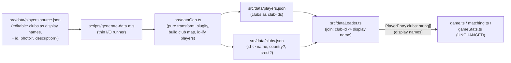

# feat: Richer player data, club-as-entity shape, and a data generator

> **Revision (post-review, superseding KTD2/KTD3 + U2/U4 + the generator):**
> the generator pipeline (`players.source.json` → `scripts/generate-data.ts` →
> `players.json` + `clubs.json`, via `tsx`) was dropped in favor of a **single
> hand-authored `src/data/data.json`** with two id-keyed maps, `players`
> (`id → { name, clubs: [clubIds] }`) and `clubs` (`id → { name, country? }`).
> The loader resolves club ids → display names exactly as planned (R1/R5 hold);
> what changed is that ids are authored by hand rather than slugified by a build
> step. The generator's guarantees are replaced by tests: referential integrity
> (every referenced club id exists) and club-id-is-slug consistency, plus the
> legacy-id/sequence lock (R6). No `dataGen.ts`, `scripts/`, `tsx`, or
> `gen:data`. Everything below about *what* the data expresses still holds; the
> generator-specific mechanics (KTD2/KTD3, U2, U4, Output Structure) are
> historical.

## Summary

Promote the minimal `players.json` dataset (`{ id, name, clubs: string[] }`, 4 smoke-test players) to a richer, generated dataset: clubs become referenceable **entities** with stable ids (keyed in a new `clubs.json` map), players gain optional `photo`/`description` fields, and a **generator pipeline** turns an editable source list into the app-consumed data files. The generator is the headline deliverable — it is "the way to generate more data" the request asks for: add players (with clubs as plain display names) to a source file, run one npm script, and the normalized id-based `players.json` + deduplicated `clubs.json` are regenerated. The player pool is expanded well beyond the 4-player smoke set as part of this work.

Crucially, the **game-logic layer does not change**. The loader resolves club-ids back to display-name strings, so `PlayerEntry.clubs` stays `string[]` (display names) exactly as the reducer, matching, stats replay, and saved-game storage already expect. This keeps a breaking *data-file* change from becoming a breaking *game-logic or storage* change.

Assets are explicitly **out of scope** (deferred to V3b): `photo`/`description` and the club `crest` field are schema-only and must degrade gracefully when unset. Clubs keep rendering as initials on the placeholder crest, exactly as today.

---

## Problem Frame

`src/data/players.json` is minimal: each player is `{ id, name, clubs: string[] }` and clubs are bare display strings duplicated across players. There is no stable club identity to key future crest art off of, no place for player photos/descriptions, and only 4 players — a smoke-test set, not a real puzzle pool. There is also no repeatable way to add data; growing the pool today means hand-editing JSON and hand-deduplicating club strings.

This is the **data half** of the former V3 (`tasks/20260701-185929`, closed), split from the art-assets half **V3b** (`tasks/20260702-124044`). V3b needs the stable club-id contract decided here (crests key off club id; photos key off player id), so the club-id shape is the load-bearing decision.

---

## Requirements

- **R1 — Club-as-entity shape.** Clubs are promoted to referenceable entities with stable string ids, defined once in a `clubs.json` map (`id -> { name, country?, crest? }`). Player entries reference clubs by id, not by display string. (origin: TASK.md "Stable club ids", "Data-shape change")
- **R2 — Optional player media fields.** The player schema gains optional `photo` and `description` fields. Unset values must fall back gracefully (no broken rendering, no errors). Binaries land in V3b. (origin: TASK.md "Player photo/description fields")
- **R3 — Real player pool.** Expand the dataset well beyond the 4-player smoke set to a genuine puzzle pool. (origin: TASK.md "A real player pool")
- **R4 — Data generator.** Provide a repeatable, deterministic, network-free way to (re)generate the dataset: an editable source list of players (clubs as plain display names) is normalized into the id-based `players.json` and the deduplicated `clubs.json`. Exposed as an npm script. (origin: user emphasis — "We need a way to generate more data")
- **R5 — Game logic unchanged.** The reducer (`src/game.ts`), matching (`src/matching.ts`), stats replay (`src/gameStats.ts`), and saved-game storage (`src/gameStorage.ts`) continue to work unchanged. `PlayerEntry.clubs` remains an ordered `string[]` of display names produced by the loader. (origin: TASK.md "Keep the game reducer / matching / stats replay working")
- **R6 — Saved-game safety.** The `localStorage` saved-game/stats schema must not be orphaned: existing saved games key off `playerId` + guesses and replay against `player.clubs` display names. Existing player ids (`neymar`, `messi`, `ronaldo`, `mbappe`) and their club display-name sequences must be preserved exactly. (origin: TASK.md "Storage safety"; AGENTS.md safety note)
- **R7 — CI green.** `npm run ci` passes, including extended loader/generator tests for the new shape. (origin: TASK.md checklist)

---

## Key Technical Decisions

### KTD1 — Club ids in a separate `clubs.json` map; loader resolves ids back to display names
Adopt the task's proposed shape: `players.json` entries carry `clubs` as arrays of **club ids**, and a new `src/data/clubs.json` maps `id -> { name, country?, crest? }`. The loader (`src/dataLoader.ts`) joins the two and emits `PlayerEntry.clubs` as the ordered array of **display names** (`clubs.json[id].name`). Rationale: the game reducer only ever needs display names (`state.player.clubs.slice(...)`), so resolving in the loader confines all churn to the data layer and keeps `game.ts`/`matching.ts`/`gameStats.ts`/`gameStorage.ts` byte-for-byte unchanged (R5). This is the minimize-churn option the task calls out.

### KTD2 — Editable source list + generator, with generated files committed
Introduce `src/data/players.source.json` as the human-editable input: a list of players with `clubs` as **plain display-name strings** (the natural format to hand-write or paste), plus `id` and optional `photo`/`description`/club-`country`. A generator normalizes it into the two app-consumed files. The generated `players.json` and `clubs.json` are **committed** so the app and CI build without running the generator; the generator is for regeneration, not a build-time step. Rationale: satisfies R4 (a real pipeline: edit source → run script → regenerated data) while keeping the runtime data-load path (webpack `asset/resource` JSON fetch) unchanged.

### KTD3 — Pure transform in `src/dataGen.ts`, thin runner in `scripts/`
The deterministic transform (slugify a club display name to an id, build the deduplicated club map, build id-based player entries, resolve ids back to names) lives in a pure, DOM-free module `src/dataGen.ts` — unit-tested and covered like the rest of the logic layer. A thin `scripts/generate-data.mjs` does only file I/O (read source, call the pure transform, write the two JSON files with stable key ordering + trailing newline so `prettier`/CI stay happy). Rationale: keeps generation logic testable and coverage-counted; keeps side-effectful I/O out of the tested unit. The same club-map→name resolution helper is shared by `dataLoader.ts` (no duplicated lookup logic).

### KTD4 — Stable ids: source is authoritative for ids; slugify only fills gaps
Club id = `slugify(display name)` (lowercase, strip diacritics, non-alphanumerics → single hyphen; e.g. "Paris Saint-Germain" → `paris-saint-germain`). Player id = the explicit `id` in the source, verbatim. The four existing players keep their custom short ids (`neymar`, `messi`, `ronaldo`, `mbappe`) by carrying those ids in the source (R6). Slugify is only a fallback for a missing club id and is never applied to player ids that already exist. Rationale: club ids can be derived safely (crest filenames key off them in V3b), but player ids are a storage key and must be preserved, not re-derived.

### KTD5 — Assets stay placeholders
`photo` (player), `description` (player), and `crest` (club) are optional schema fields only. The UI continues to render club initials on the shared placeholder crest (`src/ui/panel.ts` `clubInitials` + `crest-placeholder.svg`) and shows nothing for photo/description. No asset wiring, no silhouette image — that is V3b. Rationale: the request explicitly scopes assets out ("keep placeholders / initials like right now").

---

## High-Level Technical Design

Data flow, source → committed files → runtime:



The runtime path (right of the committed JSON files) is what ships; the generator path (left) is a developer tool. The loader is the single seam where the id-based files collapse back into the display-name `string[]` the game logic already consumes.

---

## Output Structure

New and changed data-layer files:

```
src/
  data/
    players.source.json   NEW  editable source (clubs as display names)
    players.json          CHANGED  now club-ids; regenerated + expanded pool
    clubs.json            NEW  id -> { name, country?, crest? } map
  dataGen.ts              NEW  pure transform (slugify, build maps) + name resolver
  dataLoader.ts           CHANGED  join players + clubs; resolve ids -> names
  types.ts                CHANGED  add RawClub/ClubMap types; optional photo/description
scripts/
  generate-data.mjs       NEW  thin runner: read source -> transform -> write files
test/
  dataGen.test.ts         NEW  pure transform + slugify + dedup + resolution tests
  dataLoader.test.ts      NEW  loader join + graceful-fallback tests
```

---

## Implementation Units

### U1. Data-layer types for clubs and optional player media
**Goal:** Extend `src/types.ts` with the club-entity and generator-facing types, and add optional player media fields, without changing the shape the reducer reads.
**Requirements:** R1, R2, R5.
**Dependencies:** none.
**Files:** `src/types.ts`.
**Approach:** Add a `RawClub` interface (`{ name: string; country?: string; crest?: string }`) and a `ClubMap = Record<string, RawClub>` type for `clubs.json`. Add a `RawPlayerEntry` shape reflecting the new committed `players.json` (`{ id, name, clubs: string[] /* club-ids */, photo?, description? }`) — either here or kept local to the loader (implementer's call; keep one definition, no duplication). Add optional `photo?: string` and `description?: string` to `PlayerEntry`. **Do not** change `PlayerEntry.clubs` — it stays `string[]` (display names). `GameState`/`GameView` are untouched.
**Patterns to follow:** existing interface style in `src/types.ts` (JSDoc on non-obvious fields).
**Test scenarios:** `Test expectation: none -- type-only change; behavior is exercised by U3/U4 tests.` (typecheck via `tsc`/lint is the guard.)
**Verification:** `npm run lint` clean; downstream units compile against the new types.

### U2. Pure data-generation transform (`src/dataGen.ts`)
**Goal:** Implement the deterministic, DOM-free transform that turns the source list into the id-based player list + club map, plus the shared club-id→display-name resolver used by the loader.
**Requirements:** R1, R4, R6.
**Dependencies:** U1.
**Files:** `src/dataGen.ts`, `test/dataGen.test.ts`.
**Approach:** Export pure functions:
- `slugifyClub(name: string): string` — lowercase, strip diacritics (NFD + combining-mark removal, matching the accent-folding spirit of `src/matching.ts`), collapse non-alphanumerics to single hyphens, trim leading/trailing hyphens. `"Paris Saint-Germain" -> "paris-saint-germain"`, `"Al-Nassr" -> "al-nassr"`.
- `buildClubMap(source): ClubMap` — collect every distinct club display name across all source players, key by `slugifyClub(name)`, carry optional `country`/`crest` when present in source; last-writer-wins with an assertion that two different display names never collide onto one id (fail loudly if they do).
- `buildPlayers(source): RawPlayerEntry[]` — map each source player to `{ id, name, clubs: clubDisplayNames.map(slugifyClub), photo?, description? }`, preserving club order and player `id` verbatim (KTD4).
- `resolveClubs(clubIds: string[], clubMap: ClubMap): string[]` — map ids back to display names; shared with the loader (U3).
**Execution note:** Implement test-first for `slugifyClub` and the id-collision assertion — these are the correctness-critical, edge-case-heavy pieces.
**Patterns to follow:** accent folding in `src/matching.ts`; pure/injectable style of the logic layer (no `fs`, no DOM).
**Test scenarios:**
- `slugifyClub` happy path: `"Barcelona" -> "barcelona"`, `"Manchester United" -> "manchester-united"`.
- `slugifyClub` diacritics/punctuation: `"Paris Saint-Germain" -> "paris-saint-germain"`, `"Beşiktaş" -> "besiktas"`, `"1. FC Köln" -> "1-fc-koln"`.
- `buildClubMap` dedup: two players sharing "Barcelona" yield exactly one `barcelona` entry.
- `buildClubMap` carries `country`/`crest` through when the source provides them; omits them (undefined) when it does not (R2 graceful-fallback at the data level).
- `buildClubMap` collision guard: two distinct display names slugging to the same id throws a clear error.
- `buildPlayers` preserves club order and repeated clubs (e.g. Ronaldo's two Manchester United stints stay two entries in order).
- `buildPlayers` preserves the source `id` verbatim (does not slugify player names) — asserts `messi` stays `messi` (R6).
- `resolveClubs` round-trips: `buildPlayers` ids resolved through `buildClubMap` reproduce the original display-name sequence.
**Verification:** `test/dataGen.test.ts` passes; transform is deterministic (same input → identical output) and pure.

### U3. Loader join + graceful fallback (`src/dataLoader.ts`)
**Goal:** Load both `players.json` and `clubs.json`, resolve club ids to display names, and emit `PlayerEntry[]` with `clubs: string[]` (display names) plus passed-through optional `photo`/`description`.
**Requirements:** R1, R2, R5.
**Dependencies:** U1, U2.
**Files:** `src/dataLoader.ts`, `test/dataLoader.test.ts`.
**Approach:** Mirror the existing `require("./data/players.json") as string` + `fetch` pattern for `clubs.json` (same webpack `asset/resource` handling — no webpack config change needed). Parse both, then build each `PlayerEntry` as `{ id, name, clubs: resolveClubs(raw.clubs, clubMap), photo: raw.photo, description: raw.description }` using U2's `resolveClubs`. **Graceful fallback:** if a club id is missing from the map, fall back to the id string itself rather than throwing (keeps a data typo from blanking the game); `photo`/`description` simply stay `undefined` when unset. Keep the function `async` and its `GameData` return shape.
**Execution note:** `dataLoader` was previously untested; add its first test file. Use an injected/mocked `fetch` (and stub the `require`d URLs) so the test is deterministic — follow the dependency-injection convention in AGENTS.md (loader stays testable).
**Patterns to follow:** existing `loadGameData` structure; `storage.ts` injectable-provider testing style.
**Test scenarios:**
- Happy path: given a players list with club ids and a matching club map, returns players whose `clubs` are the resolved display names in order.
- Repeated clubs resolve correctly (Ronaldo's two Man United stints → two "Manchester United" entries).
- Missing club id falls back to the id string, does not throw.
- `photo`/`description` present → passed through; absent → `undefined` (no crash).
- Returned `PlayerEntry.clubs` is a plain `string[]` the reducer can `.slice()` (shape parity with the pre-change loader output).
**Verification:** `test/dataLoader.test.ts` passes; `game.test.ts`/`gameStats.test.ts`/`matching.test.ts` still pass unchanged against loader-shaped players.

### U4. Generator runner + npm script (`scripts/generate-data.mjs`)
**Goal:** A one-command, deterministic regeneration of `players.json` + `clubs.json` from the source.
**Requirements:** R4, R7.
**Dependencies:** U2.
**Files:** `scripts/generate-data.mjs`, `package.json` (add `"gen:data"` script), `src/data/players.source.json` (created here or in U5).
**Approach:** Node ESM script (`.mjs`, already covered by the `format` glob). Read `src/data/players.source.json`, call U2's `buildClubMap` + `buildPlayers` (import the transform — see Deferred note on JS↔TS import), write `src/data/players.json` and `src/data/clubs.json` with stable key ordering and a trailing newline so a subsequent `prettier`/`format:check` is a no-op. No network, no non-determinism. Add `"gen:data": "node scripts/generate-data.mjs"` to `package.json` scripts.
**Execution note:** This is tooling/IO; prefer a runtime smoke check (run `npm run gen:data`, confirm the two files regenerate identically to the committed ones and `format:check` stays green) over unit-testing the I/O wrapper — the logic is already unit-tested in U2.
**Patterns to follow:** existing `.mjs`/config files covered by the `format` script.
**Test scenarios:** `Test expectation: none -- thin I/O wrapper; transform logic is covered by test/dataGen.test.ts (U2). Verified by running the script.`
**Verification:** `npm run gen:data` runs clean; regenerating over the committed files produces no git diff; `npm run format:check` passes on the outputs.

### U5. Author the source list, regenerate, and expand the pool
**Goal:** Create `players.source.json` seeded with the 4 existing players (ids preserved) plus a substantially larger, well-known player pool; regenerate the committed data files.
**Requirements:** R3, R6.
**Dependencies:** U2, U4.
**Files:** `src/data/players.source.json`, `src/data/players.json` (regenerated), `src/data/clubs.json` (regenerated).
**Approach:** Author the source with the four existing entries first — `neymar`, `messi`, `ronaldo`, `mbappe` — carrying their **exact** current ids and club display-name sequences (including Ronaldo's repeated Manchester United), so their generated output preserves saved-game compatibility (R6). Then add a meaningful pool (aim for ~30+ players) of well-known footballers with real club career sequences, clubs as display names; leave `photo`/`description` unset. Optionally set club `country` where obvious (it is optional). Run `npm run gen:data` to produce the committed `players.json` (club-ids) and `clubs.json` (map). Pull player/club facts from general knowledge; accuracy of career order matters (it is the puzzle), asset fields do not.
**Execution note:** After regenerating, diff the four legacy players' resolved output to confirm ids and club display-name order are byte-stable vs. the pre-change `players.json`.
**Patterns to follow:** current `players.json` entries as the canonical example of id + club-name sequences.
**Test scenarios:**
- Add a guard test (in `test/dataGen.test.ts` or a small `test/data.test.ts`): the four legacy player ids exist in the generated output and their resolved club display-name sequences equal the known pre-change sequences (locks R6).
- Guard: every club id referenced by any player exists as a key in `clubs.json` (referential integrity).
- Guard: the pool has at least a threshold count of players (e.g. `>= 25`) so the expansion can't silently regress.
**Verification:** generated files are in sync with source (`npm run gen:data` → no diff); integrity + legacy-id guard tests pass; the running app (`npm run serve`) plays with the expanded pool and clubs still render as initials.

### U6. CI + docs alignment
**Goal:** Ensure the full gate passes and the data workflow is discoverable.
**Requirements:** R7.
**Dependencies:** U1–U5.
**Files:** `AGENTS.md` (short note on the data-generation workflow + new files), `tasks/20260702-124105/TASK.md` (status/what-changed on close — per repo task convention).
**Approach:** Confirm `npm run ci` (format:check + lint + test:coverage) is green with the new tests. Add a brief AGENTS.md note under Domain Notes / Directory Layout: `players.source.json` is the editable source of truth for the dataset; `players.json`/`clubs.json` are generated via `npm run gen:data`; assets are V3b. Update the tatr task `STATUS` and record what changed on close.
**Patterns to follow:** existing AGENTS.md Domain Notes tone; the "Stats are derived, not logged" style of concise domain note.
**Test scenarios:** `Test expectation: none -- docs/CI-config alignment; covered by the suite passing.`
**Verification:** `npm run ci` green; AGENTS.md describes how to regenerate data.

---

## Verification Contract

- `npm run ci` passes (format:check + lint + test:coverage), coverage thresholds unchanged (branches 65 / functions 95 / lines 93 / statements 89). New `src/dataGen.ts` and `src/dataLoader.ts` are coverage-counted and must meet thresholds; `scripts/**` and `*.json` are not in the coverage set.
- `npm run gen:data` regenerates `players.json` + `clubs.json` with **no** resulting git diff against the committed files (deterministic + in-sync).
- The four legacy players (`neymar`, `messi`, `ronaldo`, `mbappe`) keep their ids and exact club display-name sequences (saved-game safety, R6).
- Every club id referenced by a player resolves to a `clubs.json` entry (referential integrity), and missing ids fall back gracefully rather than throwing.
- `game.test.ts`, `matching.test.ts`, `gameStats.test.ts`, `gameStorage.test.ts` pass unchanged — game logic and storage are unaffected.
- Manual: `npm run serve` → the game plays with the expanded pool; clubs render as initials on the placeholder crest (no asset regressions).

## Definition of Done

R1–R7 satisfied: clubs are id-keyed entities in `clubs.json`; players reference clubs by id with optional `photo`/`description`; the pool is expanded (~30 players) via a committed, regenerable source + generator (`npm run gen:data`); the loader resolves ids→display names so the reducer/matching/stats/storage are unchanged; saved games are not orphaned; and `npm run ci` is green. Assets remain placeholders (V3b).

---

## Scope Boundaries

**In scope:** the `players.json`/`clubs.json` shape change; optional `photo`/`description`/`crest` schema fields (unset); the source list + generator pipeline + npm script; loader/types changes; pool expansion; loader/generator tests; a short docs note.

**Out of scope (V3b — `tasks/20260702-124044`):** any actual crest SVGs, player photos, or silhouette placeholder art; wiring `photo`/`description`/`crest` into the UI; per-club crest rendering (initials stay). The club-id contract decided here (KTD1/KTD4) is the input V3b consumes.

### Deferred to Follow-Up Work

- **API/scrape-sourced enrichment.** This plan's generator normalizes a hand-authored source list; it does not fetch from an external football data API. If future pools need to scale past what is comfortable to hand-author, add an optional fetch-and-cache stage that emits into `players.source.json` (kept deterministic/offline for CI). Not needed to satisfy R3/R4 now.
- **Club metadata beyond `country`/`crest`** (leagues, founding year, etc.) — add fields to `RawClub` when a feature needs them.

---

## Risks & Dependencies

- **R6 saved-game orphaning (medium).** The failure mode is re-deriving player ids or reordering clubs, which would break replay of existing saved games. Mitigated by KTD4 (source carries verbatim player ids), the U5 legacy-id guard test, and the byte-stability diff check. This is the highest-risk area — treat the guard test as required, not optional.
- **JS↔TS import in the generator (low).** `scripts/generate-data.mjs` (plain ESM JS) needs `src/dataGen.ts` (TS). Deferred-to-implementation: either (a) keep `dataGen` logic importable by compiling/transpiling on the fly, (b) run the script through a TS runner (e.g. `node --experimental-strip-types` if the Node version supports it, or a dev `tsx`), or (c) duplicate the tiny slugify in the runner — **avoid (c)** if it means two sources of truth for slugify; prefer a single tested implementation. Resolve at implementation time based on the installed Node version; do not add a heavy dependency for this.
- **Coverage on new modules (low).** `src/dataGen.ts` and `src/dataLoader.ts` enter the coverage set; the U2/U3 test scenarios are scoped to keep functions/lines/branches above thresholds. Do not lower thresholds (AGENTS.md rule).
- **Dependency:** unblocks V3b art assets (`tasks/20260702-124044`); built on the V2 hint panel.

---

## Assumptions

- **Pipeline-mode inferred decisions** (no interactive confirmation in LFG): adopt the task's proposed id-based `clubs.json` shape (KTD1) rather than a display-name→crest side table; make the generator source-list-driven with committed outputs (KTD2/KTD3); target ~30 players for the pool (R3 says "well beyond 4" without a hard number). If the maintainer prefers a different pool size or a single-file `players.json`-with-embedded-clubs shape, that is a cheap post-review adjustment — the loader seam localizes it.
- Player/club career facts are drawn from general knowledge; career **order** must be correct (it is the puzzle), asset fields are irrelevant this task.

---

## Sources & Research

- Origin task: `tasks/20260702-124105/TASK.md` (V3a data effort; proposed data-shape change).
- Codebase grounding (read during planning): `src/data/players.json`, `src/dataLoader.ts` (webpack `asset/resource` + `fetch` load path), `src/types.ts`, `src/game.ts` (clubs consumed as display-name `string[]`), `src/gameStats.ts`/`src/gameStorage.ts` (playerId + guess replay), `webpack.config.js` (`.json` → `asset/resource`), `package.json` scripts. No external research required — the change is internal and pattern-following.
- Related learning: `docs/solutions/tooling-decisions/github-pages-project-subpath-public-path.md` (asset-path handling under webpack; tangential).
